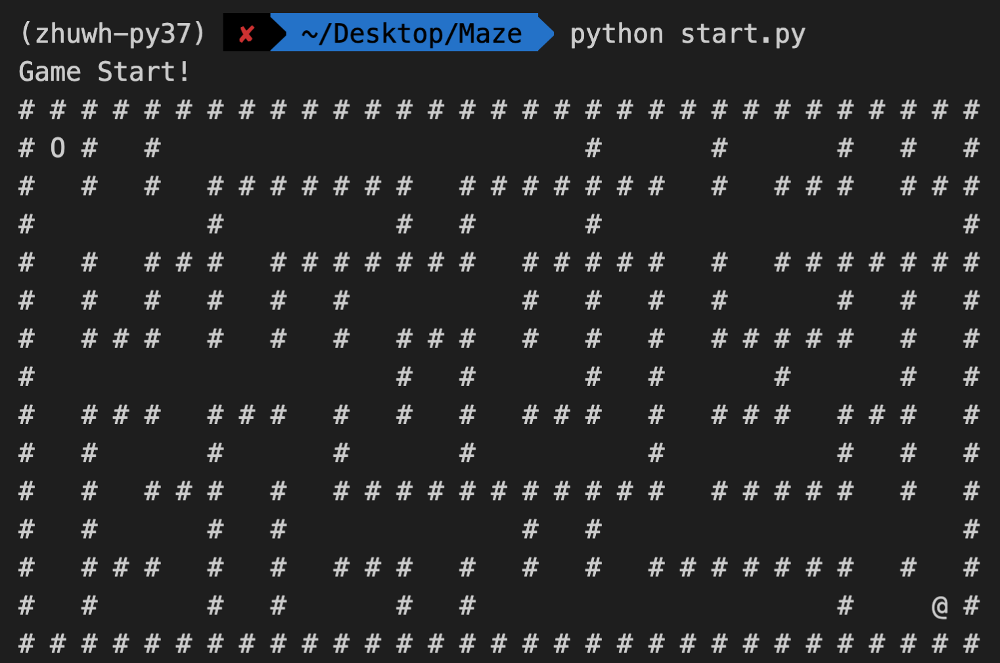
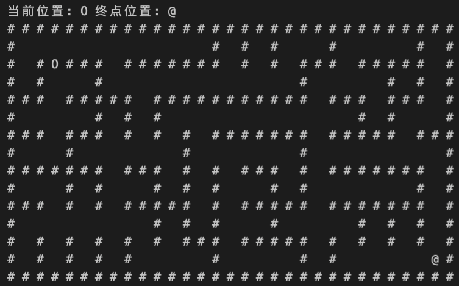
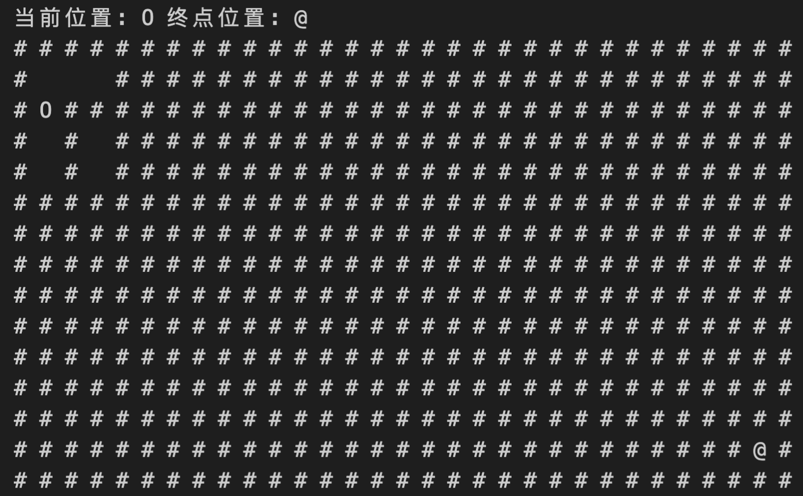

## 迷宫游戏

### 任务描述

在之前的课程中，你已经学习了许多python相关的知识，如数据结构、流程控制、面向对象以及异常处理等。在本次任务中，你需要利用已经学习的知识实现一个简易的迷宫游戏。首先，你需要实现一些基本功能，包括迷宫的自动生成，通过键盘控制智能体移动，生成迷雾遮挡智能体视野等。这些功能侧重于考察你对程序设计过程的掌握情况，你需要设计一些函数以及类帮助你完成相关的功能。接着，在以上基本功能的基础上，我们希望你继续实现一些进阶的复杂功能，如智能体自主寻路。这些功能侧重于考察你对人工智能算法的掌握情况，你需要将待解决的问题建模为一个人工智能问题，利用已有算法帮助你解决问题。这些进阶功能可以使游戏过程变得更加有趣，也会让你更有成就感。

### 建议流程

1. 自动生成迷宫：迷宫分为智能体可以通行部分(通道)和智能体不可以通行部分(墙体)，你可以尝试通过[Prime算法[1]](#说明)自动生成迷宫。

    <!-- *  -->

2. 通过键盘控制智能体：你可以通过读取键盘输入的方式，根据输入的指令，移动智能体的位置，使其不断接近终点。

<!--  -->

3. 生成迷雾遮挡智能体视野：你可以通过生成迷雾的方式，控制智能体在游戏过程中仅能获取到周围一定距离内的视野。这将大大提升游戏的难度！

<!--  -->

4. 智能体自主寻路：以上是通过人为移动智能体的方式完成游戏，这种方式似乎不是非常智能。你可以通过设计[算法[2]](#说明)让智能体自主寻路到达终点，快来探索一下吧！

5. 除了以上说明的功能外，你可以继续设计和添加其他功能，使你的游戏更加完美。

### 说明

1. 在网络上有许多Prime算法的介绍，大家可以自行查询。当然，如果你没有使用Prime算法，而是使用其他的方法来构建迷宫也是可行的。

2. 我们不限制具体采用哪种算法。不过，我们希望你设计的算法可以让智能体以尽可能最小的探索代价，最短的移动路径到达终点。

